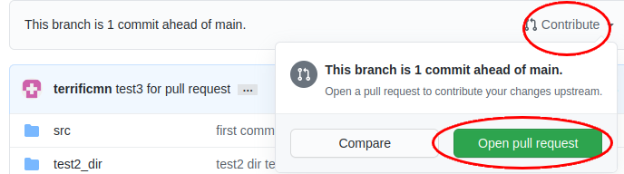
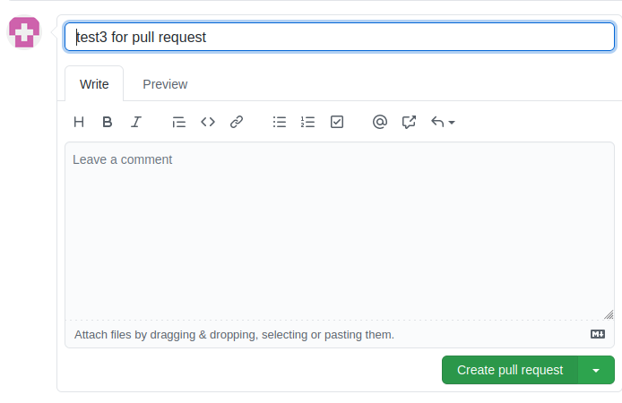

# 협업프로젝트
졸음운전 인식 후 (Sleeping-detect) 움직이는 차량(Scout-mini, 별도 레파지토리) 제어

**우분투 18.04 LTS, ROS melodic 버전, 파이썬 3.6**

<br/>

# 패키지들 소개   
1. sleeping_detect, roll-out-car

<br/>

## Ros환경에서 패키지 실행
카메라를 통한 실시간 Object Detection을 통하여, 운전자의 상태를 졸음여부를 파악 후  

(일정시간 눈 감음 지속, 해당 프로젝트에선 5초로 함)

운전자에게 경고를 주며 ( Arduino LED, Serial통신 ) 차량을 멈추는 시스템

<br/>

## Ros Master를 통하여 운전석(PC)와 차량을 연결

<br/>

# 패키지들 소개   
1. sleeping_detect, roll-out-car

<br/>

## sleeping_detect
졸음 디텍팅 프로그램 입니다. 카메라를 통해서 눈 깜빡임으로 졸음을 감지하며 눈을 오래 감고 있으면 
아두이노로 경고 LED을 표시하고 ROS를 통해 졸음 신호를 퍼블리싱 합니다.

<br/>

## roll-out-car
slepping_detect 프로그램에서 보내온 topic을 받아서 scout-mini 자동차를 제어하는 프로그램 입니다.
기본으로 사각형 모양으로 움직이다가 졸음 신호가 오면 자동차가 멈추게 됩니다.

<br/>


## 프로젝트 진행 중 git 사용법 입니다. 잘 지켜주세요~
깃에서 **브랜치**를 사용해서 작업을 해주세요!

먼저 오른쪽 상단의 Fork버튼을 눌러서 본인의 깃허브로 가져옵니다. 그리고 깃 클론을 해줍니다

```
$ git clone 본인의계정/patrol-robot
```

그리고 브랜치를 만들어주세요. 브랜치명 짓기는 아래처럼 해주세요.  
이름 이니셜과 하는 부분의 파트를 만들어 주시면 됩니다. (이니셜-개발파트이름)
예: sm-mapping
```
$ git branch 이니셜-개발파트이름
```

사실 브랜치명은 알아볼 수 있게 편하게 만들어도 상관없습니다.

만들어진 브랜치로 이동해 줍니다. sm-mapping 이라고 가정한다면
```
$ git checkout sm-mapping
```
브랜치가 바뀌었다고 나오면 정상
```
Switched to branch 'sm-mapping'
```

현재 브랜치 위치 확인하기
```
$ git branch 
```

현재 위치한 브랜치 앞에 * 표시가 붙고, 녹색으로 표시가 됩니다.
```
  main
* sm-mapping
```

이제 branch가 바뀌었으므로   

먼저 본인이 작업할 pkg 디렉토리를 하나 만들어 줍니다. 또는 가지고 있는 패키지 디렉토리를 복사/이동 시킵니다.  
그리고 그 안에서 작업 하시고, 여기에서 작업을 하고 add, commit, push 순서로 작업을 하시면 됩니다.

깃에 파일 추가해서 stage 로 인식시키기 (깃이 파일을 추적합니다)
```
$ git add [filename]
```
수정사항을 커밋~ 
```
$ git commit -m "a message for commit"
```

최종적으로 push로 remote 깃 허브에 올립니다.   
주의할점은 origin main으로 직접 **푸시하시면 안됩니다!** 본인의 브랜치명으로 푸쉬를 해줍니다  
origin [본인의브랜치명]
```
$ git push -u origin sm-mapping
```

**하루 마감** 일때 또는 적당한 시기(?)에 깃허브에서 pull request를 해주면 됩니다.
자신의 깃허브 사이트로 오면 pull request를 하라고 나오는데 적당히 클릭 클릭 해주면 됩니다.




  
<br/>

**OR**  
아래 내용은 깃허브 사이트에 말고 또는 CLI로 터미널에서 하려면 아래의 내용을 참고하세요   
먼저 main 브랜치로 이동해 줍니다.    
본인의 브랜치에서 마지막으로 commit한 내용을 push를 한 다음에 

```
$ git checkout main
```
그리고 나서, git merge [본인의 브랜치] 를 합니다
```
$ git merge sm-mapping
```
메인에서 별 다른 변경이 없었다면 fast-farward 방식으로 합병이 됩니다.  
아래는 예시 입니다.
```
Updating ce9b99f..34619a4
Fast-forward
 test2_dir/test2.txt | 1 +
 test_dir/hello.txt  | 1 +
 2 files changed, 2 insertions(+)
 create mode 100644 test2_dir/test2.txt
 create mode 100644 test_dir/hello.txt
```

그리고 상태 확인
```
$ git status
```
를 해보면
```
On branch main
Your branch is ahead of 'origin/main' by 2 commits.
  (use "git push" to publish your local commits)
```
main브런치가 2개의 commit이 앞서 있다고 나옵니다. 즉 sm-mapping에서 push한 내용이 (2번의 commit) 을 이미 한 후에  
main 브랜치와 합쳐졌기 때문에 기존의 main브랜치 입장에서는 처음을 클론을 받았을 때의 
상태이기 때문에 commit이 없는 상태  
그래서 2개의 커밋이 앞서 있다고 나오는 것임. 그래서 나온것 처럼 git push를 해주면 됩니다.
그러면 깃허브에 (remote main)으로 업데이트가 되는 것

```
$ git push
```
하면 깃허브에도 최종적으로 반영이 되게 됩니다. 조금 복잡할 수 있지만 익숙해지면 편해질 듯(?)도 합니다.

<br/>

___

## 추가로 유용한 것 깃 명령어들, 참고하세요
이메일과 아이디가 등록이 안되어 있을 때 
```
$git config --global user.name "YourID"
$git config --global user.email "youremail@domain.com"
```
원하지 않는 디렉토리/ 파일 제외하려면 깃이 있는 디렉토리에 .gitignore 파일을 만들고, 내용에 디렉토리 명을 넣어준다
```
.vscode
data/image
```

브랜치를 만들면서 바로 브랜치 변경하기
```
$ git checkout -b 브랜치명
```

브랜치 삭제하기
```
$ git branch -d 브랜치명
```

커밋한 것 취소하기. 커밋 바로 전 상태로 되돌리기
```
$ git reset --soft HEAD~1
```

add 했던 것 취소하기 
```
$ git reset HEAD file명
```

깃의 메인 브랜치가 통합되서 업데이트가 되어서 그 최신 main브랜치 내용으로 업데이트하고 싶을 때 
```
$ git checkout main
$ git rebase origin/main
```

git status를 했을 때 한글파일명이 354\213\234\354\236\221.txt 이런식으로 나올 때 설정해주기
```
$ git config --global core.quotepath false
```

윈도우에서 작업을 한다면 줄바꿈 충돌이 안나게 설정해주기 (윈도우 only)
```
$ git config --global core.autocrlf true
```

